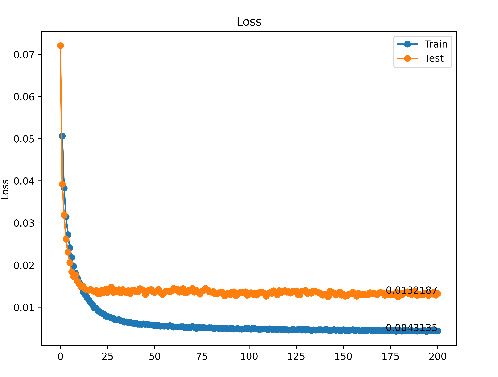

# PyTorch-CIFAR10

Using PyTorch, the following project implements a deep neural network for predicting the class of input images based on [CIFAR10](https://www.cs.toronto.edu/~kriz/cifar.html) dataset. The dataset has 10 classes including: ‘airplane’, ‘automobile’, ‘bird’, ‘cat’, ‘deer’, ‘dog’, ‘frog’, ‘horse’, ‘ship’, ‘truck’. All images are 3-channel color images of 32x32 pixels. The image below, taken from [PyTorch website](https://pytorch.org/tutorials/beginner/blitz/cifar10_tutorial.html), shows 10 sample images from each class. 

Final accuracy is around 88%. 

### Model Architecture (Deep Net)

#### Model Accuracy and Loss

Model Accuray | Model Loss 
:--------:|:-------:
|

#### Confusion Matrix 

As it is obvious, the most confused ones are `cat` and `dog` images. 

### Requirements

* [PyTorch](https://github.com/pytorch/pytorch)
* [torchvision](https://github.com/pytorch/vision)

### TODO

1. [ ] Train the model with Data Augmentation
2. [ ] Applying the Half Precision mechanism
3. [ ] Redesigning the Model  to get better results
4. [ ] Showing some images from misclassification 

#### Contents

1. `Cifar10.ipynb` - IPython notebook which implements the model 
2. `draw_convnet.py` - Code for drawing the model architecture taken from [draw_convnet](https://github.com/gwding/draw_convnet)
3. `images` folder - Contains the pictures of `Accuracy`, `Loss`, and `Confusion Matrix` in addition to `Model Architecture`. 
4. `cifar10.h5` - Trained model with accuracy of 88%. 

